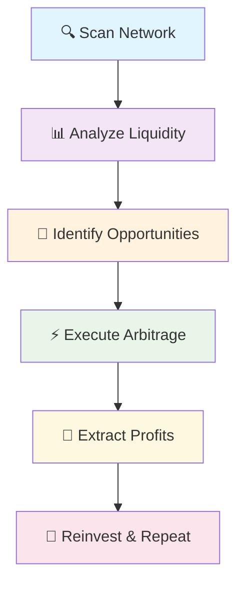

# MEV-Trading-Bot

# 🤖 MEV Bot - Advanced Arbitrage System

<div align="center">


**⚡ Automated MEV Extraction & Arbitrage Trading System ⚡**

*Educational Analysis for Web3 Security Teams*

</div>

---

## 🎯 **System Overview**

This sophisticated MEV (Maximal Extractable Value) bot operates as an autonomous trading system that monitors Uniswap V2 for profitable arbitrage opportunities and executes high-frequency trades to extract maximum value from the mempool.

### 🌟 **Core Features**

<table>
<tr>
<td width="50%">

#### 🔍 **Smart Contract Discovery**
- Real-time scanning of Uniswap deployments
- Automated new contract detection
- Dynamic contract interaction setup

#### 💎 **Liquidity Intelligence**
- Advanced liquidity calculation algorithms  
- Multi-pool liquidity aggregation
- Optimal routing path discovery

</td>
<td width="50%">

#### 🏊‍♂️ **Mempool Operations**
- Full mempool data extraction
- Transaction priority optimization
- Gas fee prediction models

#### ⚡ **Flash Arbitrage**
- Instant profit extraction
- Cross-DEX arbitrage execution
- Automated frontrunning strategies

</td>
</tr>
</table>

---

## 🚀 **Technical Architecture**

### 📡 **Network Scanning Module**

```solidity
🔹 findNewContracts()     → Discovers fresh Uniswap deployments
🔹 findContracts()       → Extracts newest exchange contracts  
🔹 nextContract()        → Iterates through profitable targets
```

### 💰 **Liquidity Analysis Engine**

```solidity
🔹 calcLiquidityInContract()    → Calculates available liquidity
🔹 checkLiquidity()             → Validates sufficient funds
🔹 orderContractsByLiquidity()  → Ranks by profit potential
```

### ⚡ **Mempool Intelligence**

```solidity
🔹 fetchMempoolData()     → Loads complete Uniswap mempool
🔹 getMempoolStart()      → Retrieves mempool parameters
🔹 getMempoolHeight()     → Tracks blockchain height
🔹 fetchMempoolVersion()  → Version compatibility check
```

---

## 🎮 **Operation Workflow**

<div align="center">



</div>

### 🎯 **Step-by-Step Process**

| Step | Function | Description |
|------|----------|-------------|
| 1️⃣ | **Network Monitoring** | Continuously scans Uniswap for new contract deployments and liquidity additions |
| 2️⃣ | **Opportunity Analysis** | Calculates potential arbitrage profits across multiple DEX pools |
| 3️⃣ | **Mempool Intelligence** | Analyzes pending transactions to identify frontrunning opportunities |
| 4️⃣ | **Trade Execution** | Performs high-speed arbitrage trades with optimal gas pricing |
| 5️⃣ | **Profit Extraction** | Automatically extracts and compounds trading profits |

---

## 💎 **Key Functions**

<details>
<summary><b>🚀 Trading Operations</b></summary>

### **`start()`** - Launch Trading Engine
- Initiates automated arbitrage scanning
- Performs frontrun operations across pools
- Optimizes for maximum extractable value

### **`withdrawal()`** - Profit Extraction  
- Instantly withdraws accumulated profits
- Transfers earnings to deployer address
- Maintains operational capital reserves

</details>

<details>
<summary><b>🔍 Discovery Functions</b></summary>

### **Contract Intelligence**
- **`loadCurrentContract()`** - Loads target contracts into memory
- **`startExploration()`** - Begins systematic contract analysis
- **`memcpy()`** - Efficient memory operations for data handling

### **String Processing**
- **`uint2str()`** - Converts numeric data to readable format
- **`mempool()`** - Combines mempool data streams
- **`keccak()`** - Generates contract hash signatures

</details>

---

## 🛠️ **Configuration**

### 📋 **Contract Details**
- **Name:** `MEv BOT`
- **Symbol:** `MEVbot`  
- **Solidity:** `^0.8.20`
- **Network:** Ethereum Mainnet

### 🔗 **Integrated Protocols**
- ✅ Uniswap V2 Core
- ✅ Uniswap V2 Factory
- ✅ ERC20 Token Standards
- ✅ Ethereum Virtual Machine

---

## 🎓 **Educational Insights**

### 🚨 **Security Analysis Checklist**

<table>
<tr>
<td width="33%">

#### 🔍 **Code Patterns**
- [ ] Function complexity vs utility
- [ ] Hardcoded vs dynamic addresses  
- [ ] Access control mechanisms
- [ ] Balance transfer operations

</td>
<td width="33%">

#### 🧪 **Testing Protocols**
- [ ] Testnet deployment verification
- [ ] Function execution tracing
- [ ] Gas optimization analysis
- [ ] Security audit requirements

</td>
<td width="34%">

#### 📊 **Risk Assessment**
- [ ] Fund deposit requirements
- [ ] Withdrawal mechanism review
- [ ] Contract upgrade patterns
- [ ] External dependency risks

</td>
</tr>
</table>

/Uniswap-FF007A?style=flat&logo=uniswap&logoColor=white)](https://uniswap.org)

</div>
