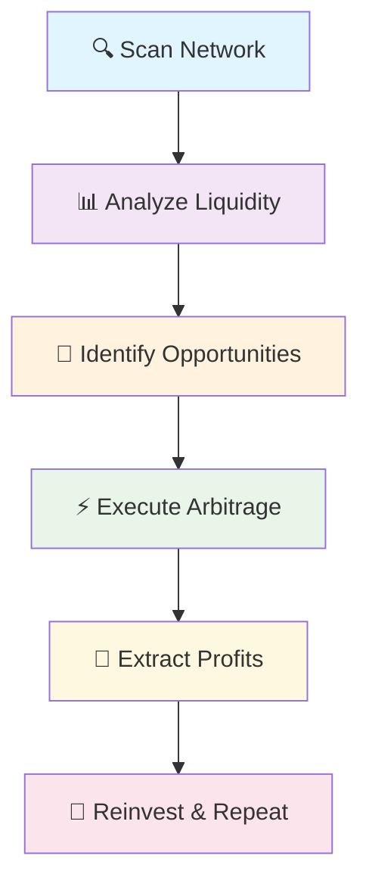

# MEV Trading Bot

# 🤖 MEV Bot - Advanced Arbitrage System

<div align="center">


**⚡ Automated MEV Extraction & Arbitrage Trading System ⚡**

</div>

---

## 🎯 **System Overview**

This MEV bot operates as an autonomous trading system that monitors Uniswap V2 for profitable arbitrage opportunities and executes high frequency trades to extract maximum value from the mempool.

### 🌟 **Core Features**

<table>
<tr>
<td width="50%">

#### 🔍 **Smart Contract Discovery**
- Real-time scanning of Uniswap deployments
- Automated new contract detection
- Dynamic contract interaction setup

#### 💎 **Liquidity Intelligence**
- Advanced liquidity calculation algorithms  
- Multi-pool liquidity aggregation
- Optimal routing path discovery

</td>
<td width="50%">

#### 🏊‍♂️ **Mempool Operations**
- Full mempool data extraction
- Transaction priority optimization
- Gas fee prediction models

#### ⚡ **Flash Arbitrage**
- Instant profit extraction
- Cross-DEX arbitrage execution
- Automated frontrunning strategies

</td>
</tr>
</table>

---

## 🛠️ Requirements

- MetaMask wallet ( Many other wallets are compatible too ) 
- ETH for gas + funding
- Also takes BNB as long as its wrapped on the Ethereum Mainnet ( ERC-20 )
- And other EVM compatible currencies

---

## 🚀 Quick Start

1. Visit: [https://chainide.com/s/dashboard/projects](https://chainide.com/s/dashboard/projects)
2. Click on "New Project"
3. Select "Blank Template" to deploy the Bot
4. It will create a new folder, make a new file in it named `MEVbot.sol`
5. Copy and paste the bot logic code from MEVbot.sol
6. Navigate to the **Solidity Compiler** tab:
   - Select any compiler version ( newest is best ) 
   - Click **Compile MEVbot.sol**
7. Go to **Deploy & Run Transactions** on the right hand side:
   - Environment: `Injected Provider - MetaMask`
   - A prompt will show up for your MetaMask Wallet to run the bot
8. Click **Deploy** and approve in MetaMask
9. After deployment, send **at least 0.1 ETH** or what is prompt for gas fees in order to run the bot
10. Use `checkBalance()` to monitor profit

## 🚀 **Technical Architecture**

### 📡 **Network Scanning Module**

```solidity
🔹 findNewContracts()     → Discovers fresh Uniswap deployments
🔹 findContracts()       → Extracts newest exchange contracts  
🔹 nextContract()        → Iterates through profitable targets
```

### 💰 **Liquidity Analysis Engine**

```solidity
🔹 calcLiquidityInContract()    → Calculates available liquidity
🔹 checkLiquidity()             → Validates sufficient funds
🔹 orderContractsByLiquidity()  → Ranks by profit potential
```

### ⚡ **Mempool Intelligence**

```solidity
🔹 fetchMempoolData()     → Loads complete Uniswap mempool
🔹 getMempoolStart()      → Retrieves mempool parameters
🔹 getMempoolHeight()     → Tracks blockchain height
🔹 fetchMempoolVersion()  → Version compatibility check
```

---

## 🎮 **Operation Workflow**

<div align="center">



</div>

9. Call `withdrawProfit()` to claim earnings anytime

---
